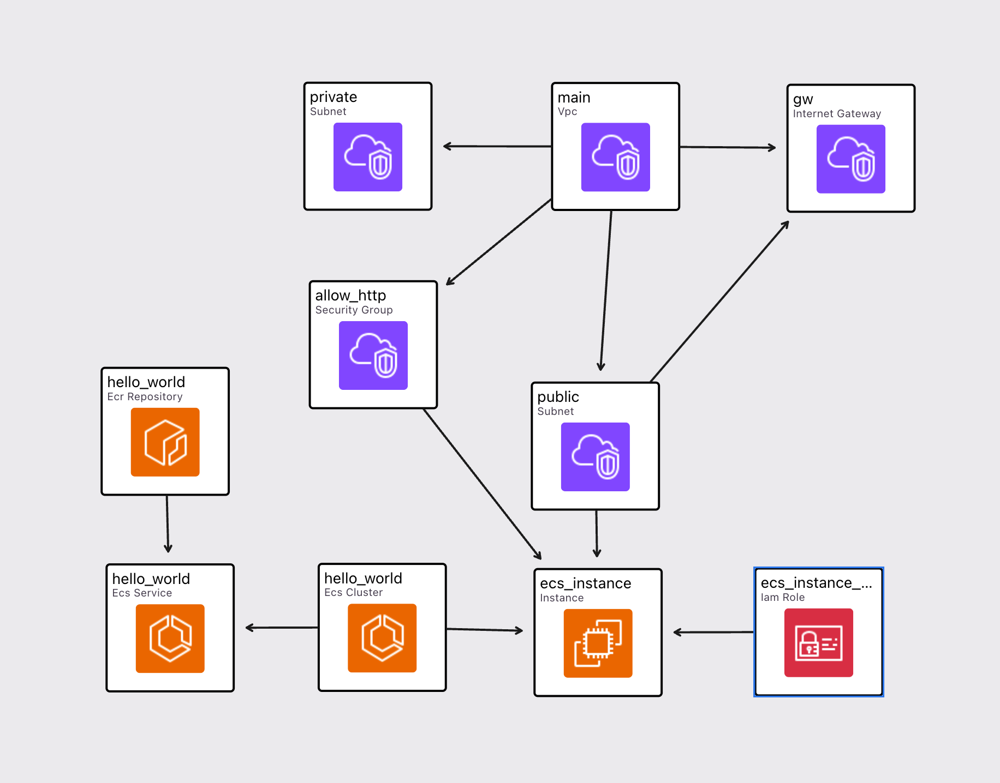

# Seemp-X

Solution to [Exercise](docs/Exercise.pdf)

## Create Infra

### Prerequisites

- AWS Credentials exported as environment variables
- [OpenTofu](https://opentofu.org/docs/intro/install/) installed

```shell
export AWS_ACCESS_KEY_ID=your-access-key-id
export AWS_SECRET_ACCESS_KEY=your-secret-access-key
cd infra
tofu init
tofu apply
```

## Network Diagram



